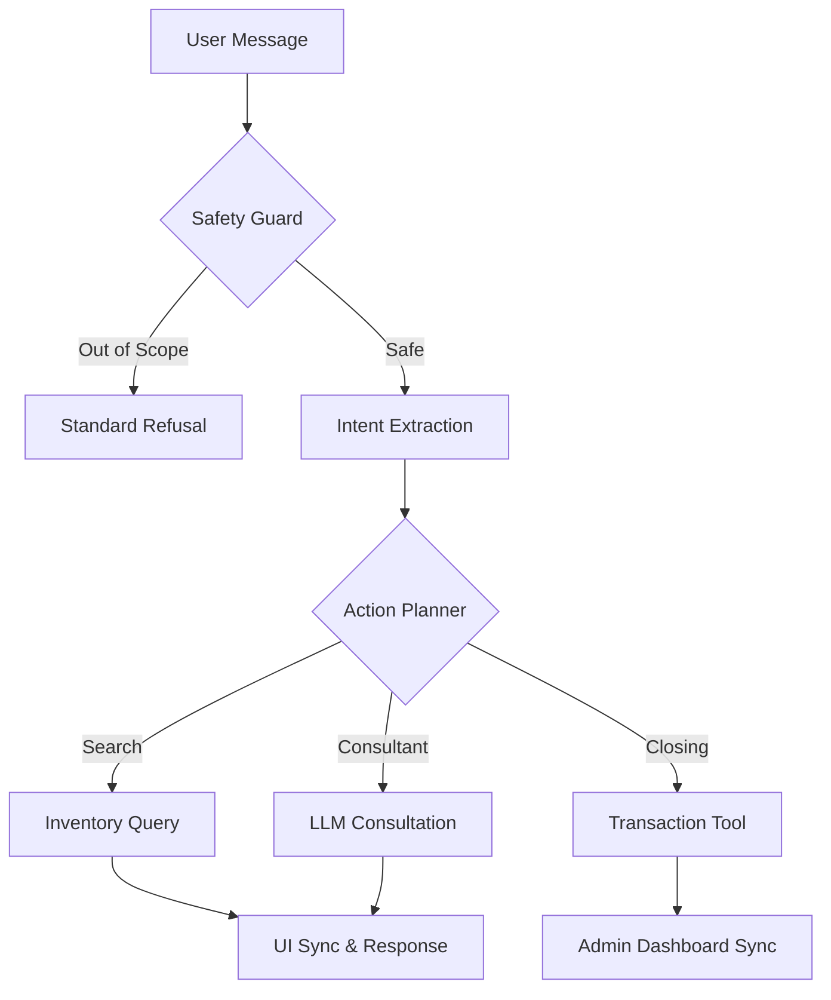

# 🏍️ PentaMo: AI Sales Intelligence for Motorbike Marketplaces

[]()
[]()
[]()

> **"This is not just a chatbot. This is 'An' — your 24/7 dedicated AI Sales Associate trained to close deals and qualify leads."**

PentaMo is an advanced AI Sales Intelligence system designed for the P2P motorbike trading industry. It moves beyond simple Q&A to provide **Consultative Selling**, **Automated Inventory Matching**, and **Full Transaction Pipelines**.

---

## 🌟 Key Features (Latest Updates)

### 1. Consultative Persona: "An"
- **Strict Persona Discipline**: The AI identifies as **"An"** and maintains a professional yet friendly tone using Vietnamese honorifics (`Anh/Chị` for users, `em` for self) consistently.
- **Consultative Intent**: Instead of immediately dumping search results, "An" asks qualifying questions about usage, height (vóc dáng), and preferences to find the *perfect* fit.

### 2. Intelligent Search & UI Synchronization
- **Zero-Latent Filtering**: AI-extracted parameters (Price, Brand, Province) are automatically synchronized with the frontend UI. If "An" finds a 15M bike, the website's price slider moves to 15M instantly.
- **Area-Aware Discovery**: Supports deep location-based search (e.g., "xe ở Hồ Chí Minh") directly through the orchestration pipeline.

### 3. E2E Transaction Pipeline
- **Smart Booking**: Automated tool `book_appointment` creates real-time database entries for viewing requests.
- **Sales Closing**: The `create_purchase_order_and_handoff` tool manages the transition from lead to transaction, notifying admins immediately.

---

## 🎨 System Architecture: Orchestrator v3

PentaMo Orchestrator v3 follows a high-precision lifecycle for every interaction.



---

## 🧪 Testing & Verification

We maintain a rigorous test suite to ensure the pipeline's integrity.

### End-to-End Pipeline Tests
```bash
# Verify the Sales Closing (Transaction) pipeline
python3 scratch/test_closing_pipeline_report.py

# Verify the Appointment Booking pipeline
python3 scratch/test_booking_pipeline_report.py

# Verify the AI Persona & Pronoun discipline
python3 scratch/test_ai_scenarios.py
```

### Safety & Scope Tests
```bash
# Verify rejection of off-topic (love, weather, finance) queries
python3 scratch/test_out_of_scope.py
```

---

## 🛠️ Specialized Documentation

For a deep dive into the system design, please refer to:

- [🧠 State Schema Design](./documentation/ARCHITECTURE/STATE_SCHEMA.md): Deterministic state management.
- [💾 Memory Strategy](./documentation/ARCHITECTURE/MEMORY_STRATEGY.md): 3-tier approach to context.
- [📊 Evaluation Report](./documentation/REPORTS/evaluation_report.md): Performance metrics and feedback analysis.

---

## 📈 Roadmap
- **Financial Qualifying**: Real-time installment calculations based on user's budget.
- **Lead Scoring**: Assigning "hot/cold" scores to conversations for prioritized admin handling.
- **Multi-channel Handoff**: Bridging AI chat directly into Zalo/Messenger for human closing.

---

*Developed with ❤️ as part of the PentaMo Sales Intelligence Suite.*
