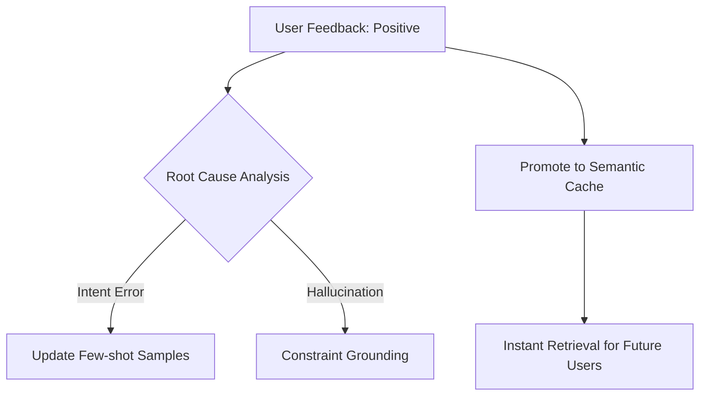

# 🧠 Strategic Memory Management

A sophisticated AI Product requires more than just a chat window; it requires **Memory**. Our system implements a **Three-Tier Memory Architecture** to balance performance, relevance, and long-term learning.

---

## 1. The Three-Tier Architecture

### 📁 Tier 1: Raw Conversation Logs
- **Source**: `chat_history.jsonl` / Database (`ChatMessages` table).
- **Function**: The "Atomic Truth". It stores exactly what was said, by whom, and when.
- **Usage**: Used for deep-dive error analysis, legal audits, and training data generation.
- **Retention**: Permanent (or subject to GDPR/data policy).

### ⚡ Tier 2: Semantic Memory (FAISS)
- **Source**: Vector DB (FAISS / Pinecone).
- **Function**: The "Expert's Recall". It stores successfully resolved Q&A pairs.
- **Usage**: Before calling an LLM, the system checks the vector store. If a similar question (threshold > 0.85) was answered successfully before, the system retrieves the "Golden Answer" instantly.
- **Benefit**: Reduces LLM costs and latency to <50ms.

### 🧩 Tier 3: Structured Context (The State)
- **Source**: JSONB in PostgreSQL.
- **Function**: The "Working Brain". It stores the parsed intention and constraints of the current buyer.
- **Usage**: Injected into every LLM prompt to ensure the agent doesn't "forget" the user's budget or location preferences mid-chat.

---

## 2. Memory Compaction Strategy

As conversations grow, standard LLM context windows become cluttered with noise. We solve this through **Rolling Summarization**:

1.  **Trigger**: Every 10–15 messages.
2.  **Process**: An "Extractor" LLM summarizes the dialogue into a 3-sentence snapshot focusing on *fulfilled vs. unfulfilled constraints*.
3.  **Replacement**: The eldest 10 messages are pruned from the active prompt context, replaced by the **Rolling Summary**.

> [!NOTE]
> This ensures that even in a 100-message negotiation, the Agent remains laser-focused on the original goals.

---

## 3. Feedback-Driven Learning

Memory is not static; it improves through the **Feedback Loop**:

By distinguishing between these levels of memory, PentaMo provides a "human-like" experience where it remembers the important facts (State) and learns from past successes (Semantic), while remaining grounded in the facts (Logs).
